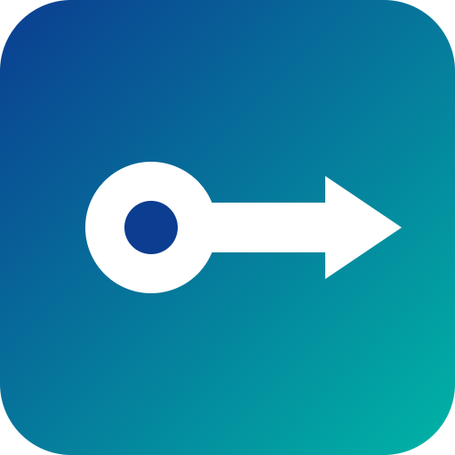

# Padala


**A self-custody USDC wallet for Filipino workers in Japan sending money to family in GCash.**

## Overview

Padala lets a sender in Japan buy USDC at SBI VC Trade (a registered Japanese exchange), withdraw it to their own Padala wallet, and send it to a family member's GCash GCrypto USDC address. The sender only signs an EIP-3009 `transferWithAuthorization`; Padala's relayer submits it and pays the gas. Padala never holds keys or funds.

## Problem

Under SBI VC Trade's published withdrawal rules, USDC cannot be withdrawn directly to PDAX, which runs GCash's GCrypto. A sender needs their own wallet in between.

## How it works

```
JPY --(SBI VC Trade: buy USDC, withdraw)--> Padala wallet (sender's own key, Ethereum)
    --(sign EIP-3009; relayer pays gas)--> family's GCash GCrypto USDC address
    --(GCash: sell to PHP)--> pesos
```

- Exchange happens in SBI VC Trade and GCash. Padala only sends.
- The relayer cannot change the recipient or the amount; they are inside the sender's signature.

## Status

Works end to end on the Ethereum Sepolia testnet: create a wallet, receive test USDC (standing in for an SBI VC Trade withdrawal), send, and the family page shows the on-chain confirmation. Not connected to real GCash accounts yet.

## Tech stack

Plain HTML/CSS/JavaScript, ethers.js, EIP-3009 (Circle USDC), Node.js relayer, Ethereum Sepolia. Built with help from Claude Code.

## Next steps

- Send a small real transfer to a GCrypto address to confirm how deposits are handled
- Test with Filipino workers in Japan and their families
- Move from Sepolia to Ethereum mainnet

## Pitch

- [Pitch deck (PDF)](docs/pitch.pdf)
- [Pitch script](docs/pitch-script.md)

## Team

- Kanji Ogahara (Solune Web, Japan) — solo builder

Built for the Colosseum Crypto World's Fair hackathon.
